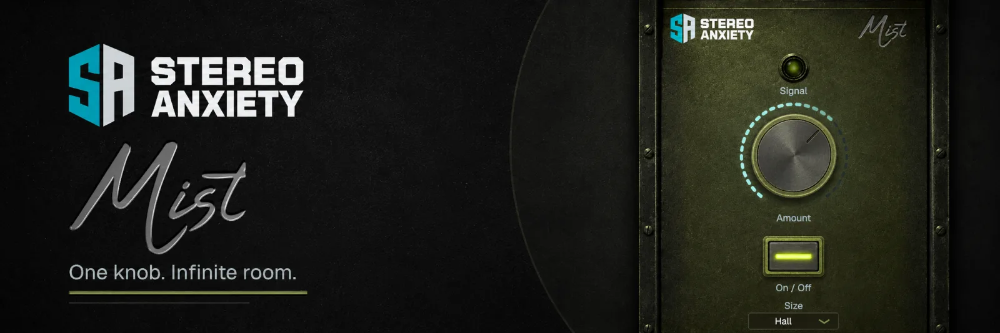
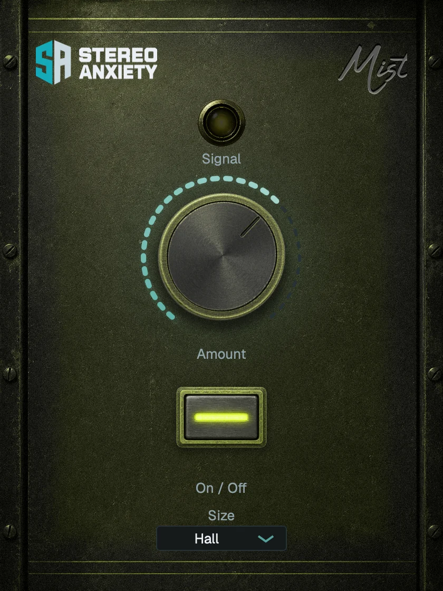

  

# Mist

**Mist is a single-knob reverb built for instant space.** Turn the one control and the
sound moves from dry to drenched — a warm, controlled room that adds depth without
washing out the low end.

VST3, AU, and Standalone on macOS (Apple Silicon + Intel) and Windows.

## Space From One Knob

Mist is an original Moorer/FDN algorithmic reverb voiced after the classic single-knob
"wetter" workflow: one macro for the wet amount, a feedback delay network with
frequency-dependent decay, prominent early reflections for depth, and stereo
decorrelation for width. Lows decay fast and a low-shelf cut keeps the tail tight, so it
adds dimension instead of mud.

## Feature Highlights

- **One-knob wet sweep**: a single macro takes the signal from a hint of air to a fully
  immersive tail.
- **Three sizes**: Room (tight, ~0.7 s), Hall, and Cathedral (long) scale the network
  and decay.
- **Tight low end**: fast LF decay plus a tail low-shelf cut keep the reverb from
  booming.
- **Depth & width**: a dedicated early-reflection stage and decorrelated L/R taps place
  the source in a believable space.
- **Click-free A/B bypass**: compare wet and dry smoothly; the tank stays warm.
- **Live signal lamp**: the front-panel LED reacts to output level and turns mint near
  clipping.

## Controls

| Control | Purpose |
| --- | --- |
| **Amount** | The macro: dry → drenched (wet level and space). |
| **Size** | Room / Hall / Cathedral — network size and decay time. |
| **On / Off** | Click-free A/B bypass. |
| **Signal** | Output activity and near-clip indication. |

## Plugin

  

